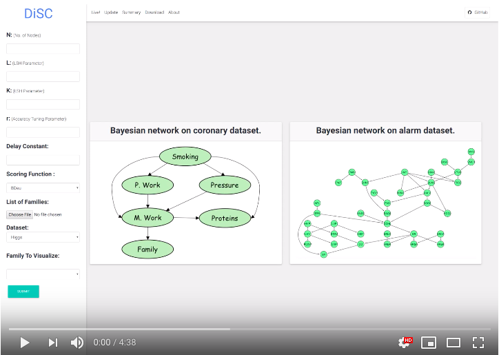

# DiSC Demo

## Introduction

The demo would provide a real-time and interactive experience to a user on how the system employs the principle of gossiping and hashing techniques in a novel way for fast approximate score computation. The user can control different aspects of the system’s execution on a cluster with up to 32 nodes. The approximate scores downloaded can be then used by existing score-based structure learning algorithms.

## Demo

## Publication
Arun Zachariah, Praveen Rao, Anas Katib, Monica Senapati, Kobus Barnard - A Gossip-Based System for Fast Approximate Score Computation in Multinomial Bayesian Networks. In the 35th IEEE International Conference on Data Engineering (ICDE), pages 1968-1971, Macau, China, 2019. ([PDF](https://conferences.computer.org/icde/2019/pdfs/ICDE2019-21DqmQqM7YlfcW2ZceNbB3/4ZwlLuw855xdSCqAOdgjvU/4uoTWWH9aUYU7HTj38KqyJ.pdf))
